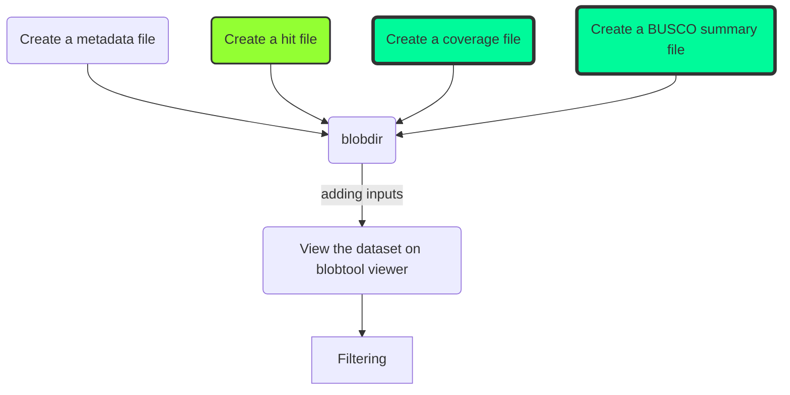

# BlobToolKit Course

Authors:
* [Slimane Khayi](https://github.com/SolayMane)
* [Abdoallah Sharaf](https://github.com/abdo3a)
* [Sujai Kumar](https://github.com/sujaikumar)

## BlobToolKit (v4.1.5) installation 

BlobToolKit is available as a pip install package. If you are used to installing pip packages, you can just run the following command:

````bash
pip install blobtoolkit[full]
````

However, if you have never run pip before, then we recommend using conda to first create a conda environment. Conda environments are easier to keep separate and update and remove without affecting anything else on your computer.

To install conda first, follow the instructions at https://docs.conda.io/en/latest/miniconda.html

Then run the commands:
```
conda create -y -n btk python=3.9
conda activate btk
pip install blobtoolkit[full]
```
Once the commands finish, you should be able to run the command `blobtools` and see an overview.

## Test the installation

Do a test to make sure everything works by typing:
```bash
blobtools
```
You should see help text for each of the `blobtools` subcommands.

To test the api server and viewer has also installed correctly, type:
```bash
blobtools host _
```
You should see something like the following message:
```
Starting BlobToolKit API on port 8000 (pid: 7837)
Starting BlobToolKit viewer on port 8080 (pid: 7850)
Visit http://localhost:8080 to use the interactive BlobToolKit Viewer.
```

If you are already running a web service or some other service on ports 8000 and 8080, you will get a message like this:
```
ERROR: Port 8000 already in use, unable to host BlobtoolKit API.
       Use: `lsof -nP -iTCP:8000 | grep LISTEN` to find the associated process.
       It may take ~30s for this port to become available when restarting BlobtoolKit API.
```
If this happens, you can either:
1. Kill the processes running on port 8000 and port 8080 or
2. You can use different ports (typically any port above 1024 should be ok) when starting blobtools, eg:
```
blobtools host _ --port 8030 --api-port 8031
```

If you are on a laptop or desktop, open any web browser and type `http://localhost:8080` in the url bar. Type `all` in the Search for Datasets section to see a default BlobToolKit plot that is loaded with the installation.

If you are installing BTK on a remote server, you will need to set up a separate ssh tunnel to the remote server. Open another terminal window and type this:
```
ssh -L :8080:127.0.0.1:8080 -L :8000:127.0.0.1:8000 USER@SERVER
```
where you would replace `USER@SERVER` with your login credentials for that server. If you had to set up a different `--port` and `--api-port` in your `blobtools host` command above, then put those numbers instead of 8080 and 8000 in this `ssh` command.

What this `ssh` command does is set up a tunnel forwarding port 8080 and 8000 on your local laptop or desktop to port 8080 and 8000 respectively on your remote server. If this command succeeds, you should be able to open any web browser on your local laptop or desktop and type `http://localhost:8080` in the url bar and continue as above.

# Workflow to work on your own genome assembly

BlobToolKit needs a blobdir for each genome assembly - a directory that contains metadata about the genome assembly and several attributes such as GC ratio coverage, BUSCO, etc, for each sequence in the assembly.



## Create a project directory

````bash
mkdir btk
````
All following commands should be executed inside this folder

## Fetch Databases

### 1. Fetch the NCBI Taxdump
````bash
mkdir -p taxdump;
cd taxdump;
curl -L ftp://ftp.ncbi.nih.gov/pub/taxonomy/new_taxdump/new_taxdump.tar.gz | tar xzf -;
cd ..;
````
### 2. Fetch the nt database

````bash
mkdir -p nt
wget "ftp://ftp.ncbi.nlm.nih.gov/blast/db/nt.??.tar.gz" -P nt/ && \
        for file in nt/*.tar.gz; \
            do tar xf $file -C nt && rm $file; \
        done
````
### 3. Fetch and format the UniProt database

````bash
mkdir -p uniprot
wget -q -O uniprot/reference_proteomes.tar.gz \
 ftp.ebi.ac.uk/pub/databases/uniprot/current_release/knowledgebase/reference_proteomes/$(curl \
     -vs ftp.ebi.ac.uk/pub/databases/uniprot/current_release/knowledgebase/reference_proteomes/ 2>&1 | \
     awk '/tar.gz/ {print $9}')
cd uniprot
tar xf reference_proteomes.tar.gz

touch reference_proteomes.fasta.gz
find . -mindepth 2 | grep "fasta.gz" | grep -v 'DNA' | grep -v 'additional' | xargs cat >> reference_proteomes.fasta.gz

echo -e "accession\taccession.version\ttaxid\tgi" > reference_proteomes.taxid_map
zcat */*/*.idmapping.gz | grep "NCBI_TaxID" | awk '{print $1 "\t" $1 "\t" $3 "\t" 0}' >> reference_proteomes.taxid_map

diamond makedb -p 16 --in reference_proteomes.fasta.gz --taxonmap reference_proteomes.taxid_map --taxonnodes ../taxdump/nodes.dmp -d reference_proteomes.dmnd
cd -
````


## Create blobtoolkit dataset, also known as blobdir

## I. Input file requirements

metadata file in yaml format to describe the project e. g. B_cinera.yaml, Can be downloaded from <a href="https://drive.google.com/file/d/1-NHpoCcrj4G7d_daytvsl-J-1RN-8wWA/view?usp=sharing">HERE</a>.
one assembly file, e.g. assembly.fasta, can be downloaded from [HERE](https://drive.google.com/file/d/1VZE8w8sQM7qHaXcfXqpzAt4mfDgbiJJz/view?usp=sharing)
one (or more) coverage file(s) e.g. mapping_1.bam, can be downloaded from [HERE](https://institutinra-my.sharepoint.com/:u:/g/personal/slimane_khayi_inra_ma/ESCG3SK2esJHt1ACg-6n1FEBJCx7euNxHRgSmrRpgRN51A?e=3OC8ca)
one (or more) hits file(s), e.g. diamond.blastx.out and blastn.out and can be respedctively downloaded from [LINK](https://drive.google.com/file/d/1dfXMbz8N5MhrZbyYGBHz7PtGTJpT2WSD/view?usp=sharing) & [LINK2](https://drive.google.com/file/d/1jl3xuqfhRsA4KIiXfo6Po0mk2pe0h6dX/view?usp=sharing)

### 1. Create a metadata file

Use any text editor and create a file called `B_cinera.yaml`. Write the following information inside the yaml file.
````
assembly:
  alias: B_cinera_112
  record_type: contig
taxon:
  name: Botrytis cinerea
````

### 2. Create a hit file(s)

#### 2.1. The blastn hit file 

````bash
blastn -db ./nt/nt \
-query assembly.fasta \
-outfmt "6 qseqid staxids bitscore std" \
-max_target_seqs 10 -max_hsps 1 \
-evalue 1e-25 -num_threads 30 \
-out blastn.out
````

#### 2.2. The diamond hit file
````bash
diamond blastx --query assembly.fasta \
--db ./uniprot/reference_proteomes.dmnd \
--outfmt 6 qseqid staxids bitscore qseqid sseqid pident length mismatch gapopen qstart qend sstart send evalue bitscore \
--sensitive --max-target-seqs 1 \
--evalue 1e-25 \
--threads 30 > diamond.blastx.out
````

### 3. Create coverage file(s)

````bash
minimap2 -ax sr -t 30 assembly.fasta \
trimmed.R1.fastq trimmed.R2.fastq \
| samtools sort -@30 -O BAM -o coverage.bam -
````

### 4. Create a BUSCO summary file

Run busco on the genome assemlby 

````bash
busco -i assembly.fasta \
-l helotiales_odb10 -o botrytis -m genome --cpu 30
````
## II. Adding input files to blobtoolkit dataset


### 1. adding assembly and a metadata files

````bash
blobtools create --fasta assembly.fasta \
--meta B_cinera.yaml  --taxid 75913 \
--taxdump ./taxdump/ ./btk
````

### 2. Adding hits

````bash
blobtools add --hits blastn.out \
--hits diamond.blastx.out \
--taxrule bestsumorder \
--taxdump ./taxdump/ ./btk
````
### 3. Adding Coverage

````bash
blobtools add --cov coverage.bam --threads 30 ./btk
```` 
### 4. Adding buscos

````bash
blobtools add --busco ./botrytis/run_helotiales_odb10/full_table.tsv ./btk

````
### III. View the dataset on blobtool viewer

### 1. Run the following command to initialize the viewer

````bash
blobtools view --remote ./btk
````
### 2. Open your browser and go to the URL indicated in the previous command (e.g http://localhost:8001/view/btk)

### IV.  Filtering blobtoolkit dataset

Datasets can be filtered based on the values in any variable (e.g. GC proportion and length) or category field (e.g. assigned phylum), or by using a list of identifiers (sequence IDs). Filters may be applied to a complete dataset to allow for use of a reduced dataset without repeating analyses or applied to assembly FASTA and read FASTQ files to allow for reassembly and reanalysis. Filter parameters are all shared between BlobTools and the BlobToolKit Viewer, allowing interactive sessions to be reproduced on the command line.

Configuration options for blobtools filter can be considered in three groups:

### 1. Setting filter parameters:

<code>--param </code> – String of type param=value to specify individual filter parameters.<br>
<code>--query-string</code> – List of param=value pairs (separated by &) pairs from url query string.<br>
<code>--json</code> – JSON format list file as generated by BlobtoolKit Viewer.<br>
<code>--list</code> – Text file containing a space or newline separated list of identifiers.<br>
<code>--invert</code>– Flag to invert the filter (exclude matching records).

### 2. Specifying files to filter:

<code>--output </code> – Path to directory to save a filtered copy of the BlobDir.<br>
<code>--fasta </code> – FASTA format assembly file to be filtered.<br>
<code>--fastq </code> – FASTQ format read file to be filtered (requires --cov).<br>
<code>--cov </code> – BAM/SAM/CRAM read alignment file.<br>
<code>--text </code> – Generic text file to be filtered.<br>
<code>--text-delimiter </code> – Text file delimiter. [Default: whitespace]<br>
<code>--text-id-column </code> – Index of column containing identifiers (1-based). [Default: 1]<br>
<code>--text-header </code> – Flag to indicate first row of text file contains field names. [Default: False]<br>
<code>--suffix </code> -STRING String to be added to filtered filename. [Default: filtered]

### 3. Generating summary data:

<code>--summary </code> – Filename for a JSON-format summary of the filtered dataset.<br>
<code>--summary-rank</code> – Taxonomic level for summary. [Default: phylum]<br>
<code>--taxrule </code> – Taxrule used when processing hits. [Default: bestsumorder]<br>
<code>--table </code> – Filename for a tabular output of filtered dataset.<br>
<code>--table-fields </code> – Comma separated list of field IDs to include in the table output. Use ‘plot’ to include all plot axes. [Default: plot]

### 1. Filter an assembly FASTA file to exclude sequences shorter than 1000 bp, to also filter the assembly to remove sequences with no hit in the reference databases and print a set of summary statistics for the filtered assembly to the terminal:

````bash
blobtools filter \
     --param length--Min=1000 \
     --param bestsumorder_phylum--Keys=no-hit \
     --fasta assembly.fasta \
     --summary STDOUT \
     ./btk/
````

### 2. If your interactive session includes a selection, details of the selection are not captured in the url query string. Instead the selection can be exported as a JSON format list file that includes details of any filter parameters and a list of selected contigs (see Reproducing interactive sessions for more details). This file can be used to filter the assembly with the --json option.

````bash
blobtools filter \
     --json /path/to/exported_list_file.json \
     --fasta assembly.fasta \
     ./btk/
````
